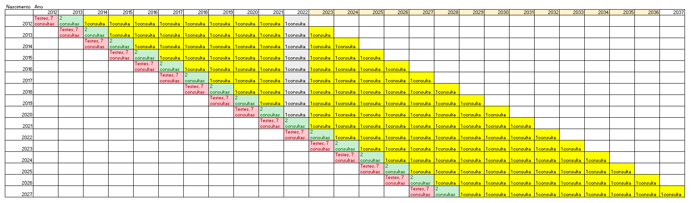
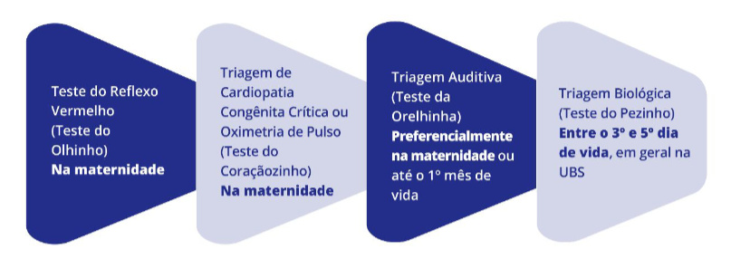
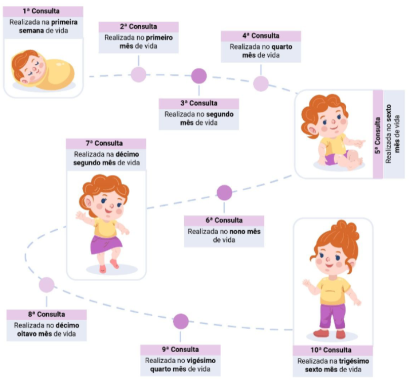
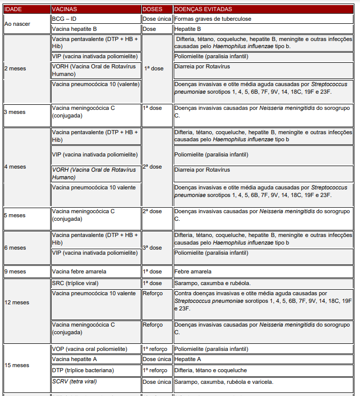

```{r setup, include=FALSE}
knitr::opts_chunk$set(echo = TRUE)
setwd("~/Dimensionamento/Meta 5/Saúde da mulher")
library(tidyverse); library(RODBC)
options(scipen = 999)

dremio_host <- "200.137.215.27"
dremio_port <- "31010"
dremio_uid <- "daniel"
dremio_pwd <- "p7USWgsqaEH3CWe"

channel <- odbcDriverConnect(sprintf("DRIVER=Dremio Connector;HOST=%s;PORT=%s;UID=%s;PWD=%s;AUTHENTICATIONTYPE=Basic Authentication;CONNECTIONTYPE=Direct", dremio_host, dremio_port, dremio_uid, dremio_pwd))

```

## Mapeamento de dados sobre saúde do Recém Nascido (RN) e Criança

A primeira informação relevante que precisamos considerar aqui é o número de RN que teremos por região, no país. A consulta abaixo acessa o datalake para computar o número de nascimentos ao longo dos últimos dez anos no país. 

Acessar os últimos dez anos é relevante por permitir que a gente avalie o horizonte temporal completo que inclui os cuidados ao RN e crianças. 

```{r}
hierarquia_municipios <- sqlQuery(channel, 'SELECT * FROM "Analytics Layer".Territorial."Municípios - Hierarquia Completa"')


df1 <- sqlQuery(channel, 'WITH 
                            consulta1 AS( 
                            SELECT CODMUNRES, UF, IDADE_MAE, DT_NASC, DT_NASC - IDADE_MAE AS ANO_NASCIMENTO_MAE 
                            FROM(
                                SELECT substr(CODMUNRES, 1, 6) AS CODMUNRES,
                                       substr(CODMUNRES, 1, 2) AS UF, 
                                       CAST(IDADEMAE AS INT) AS IDADE_MAE, 
                                       CAST(substr(DTNASC, 5, 4) AS INT) AS DT_NASC
                                FROM Dados.sinasc.DN
                                )
                            ), 
                            consulta2 AS( 
                            SELECT CODMUNRES, UF, IDADE_MAE, DT_NASC, DT_NASC - IDADE_MAE AS ANO_NASCIMENTO_MAE 
                            FROM(
                                SELECT substr(CODMUNRES, 1, 6) AS CODMUNRES,
                                       substr(CODMUNRES, 1, 2) AS UF, 
                                       CAST(IDADEMAE AS INT) AS IDADE_MAE, 
                                       CAST(substr(DTNASC, 5, 4) AS INT) AS DT_NASC
                                FROM Dados.sinasc.preliminar.sinasc_2020
                                )
                            ),
                            consulta3 AS( 
                            SELECT CODMUNRES, UF, IDADE_MAE, DT_NASC, DT_NASC - IDADE_MAE AS ANO_NASCIMENTO_MAE 
                            FROM(
                                SELECT substr(CODMUNRES, 1, 6) AS CODMUNRES,
                                       substr(CODMUNRES, 1, 2) AS UF, 
                                       CAST(IDADEMAE AS INT) AS IDADE_MAE, 
                                       CAST(substr(DTNASC, 5, 4) AS INT) AS DT_NASC
                                FROM Dados.sinasc.preliminar.sinasc_2021
                                )
                            )
                            
                            select CODMUNRES, UF, IDADE_MAE, DT_NASC, ANO_NASCIMENTO_MAE  from
                            consulta1
                            UNION
                            select CODMUNRES, UF, IDADE_MAE, DT_NASC, ANO_NASCIMENTO_MAE from consulta2
                            UNION
                            select CODMUNRES, UF, IDADE_MAE, DT_NASC, ANO_NASCIMENTO_MAE from  consulta3')
```

Sabe-se que, ao nascer, o RN passará por consultas e alguns testes. Passados três anos, ela passará por uma consulta anual para acompanhar o crescimento. 

A figura abaixo ilustra o racional adotado



# Planejamento do serviço 

O planejamento do serviço se dá a partir de algumas orientações, sendo que três dimensões são analisadas: 
* Testes do RN
* consultas
* Imunização

### Teste do RN

Os testes necessários estão na figura abaixo. 



### Consultas

A relação de consultas e período adequado para realização estão descritos na figura 3. 



### Imunizações 

Ao longo dos primeiros anos de vida, algumas vacinas serão necessárias. 




# Análise dos nascimentos por faixa etária da mãe

Foram retirados casos acima de 65 anos e menores que 12 anos, isso resultou na exclusão de 13449 observações. 

```{r message=FALSE, warning=FALSE}

df_t <- df1 %>% 
    left_join(hierarquia_municipios, by = c('CODMUNRES'='cod_municipio')) %>% 
    filter(IDADE_MAE >= 12 & IDADE_MAE <= 65) %>% 
    mutate(regiao = substr(UF, 1, 1)) %>% 
    mutate(faixa_etaria = case_when(IDADE_MAE < 18 ~ "Abaixo de 18 anos",
                                    IDADE_MAE >= 18 & IDADE_MAE < 25 ~ "Entre 18 e 24 anos",
                                    IDADE_MAE >= 25 & IDADE_MAE < 35 ~ "Entre 25 e 34 anos",
                                    IDADE_MAE >= 35 & IDADE_MAE <= 45 ~ "Entre 35 e 45 anos",
                                    IDADE_MAE > 45 ~ "Idade maior que 45 anos")) %>% 
    group_by(uf, regiao_saude, faixa_etaria, DT_NASC) %>% 
    summarise(total = n()) 


df_t$faixa_etaria <- factor(df_t$faixa_etaria, levels = c('Abaixo de 18 anos',
                                                          'Entre 18 e 24 anos',
                                                          'Entre 25 e 34 anos',
                                                          'Entre 35 e 45 anos',
                                                          'Idade maior que 45 anos'))

df_t %>% 
    group_by(uf, regiao_saude, faixa_etaria) %>% 
    summarise(cont = n(),
              total = sum(total)) 

```

 
```{r message=FALSE, warning=FALSE}

df_t_wide <- df_t %>% 
    group_by(uf, regiao_saude, faixa_etaria) %>% 
    summarise(total = sum(total)) %>% 
    pivot_wider(names_from = faixa_etaria, values_from = total) 


df_t_wide$soma <- df_t_wide$`Abaixo de 18 anos`+
                     df_t_wide$`Entre 18 e 24 anos`+
                     df_t_wide$`Entre 25 e 34 anos`+
                     df_t_wide$`Entre 35 e 45 anos`+
                     df_t_wide$`Idade maior que 45 anos`


dt_perc <- df_t_wide %>% 
    gather(key = "faixa_etaria", 
           value = "total", 
           3:7) %>% 
    mutate(percentual = 100 * (total/soma),
           percentual = round(percentual, 3))

```


# Análise do total por ano de nascimento 

```{r message=FALSE, warning=FALSE}

hierarquia_regioes <- hierarquia_municipios %>% 
                        select(cod_municipio,regiao_pad, regiao,
                               uf, uf_sigla, macrorregiao, regiao_saude) 

ano_referencia <- 2021
    
nascimentos <- df1 %>% 
    filter(DT_NASC > 2011) %>% 
    left_join(hierarquia_municipios, by = c('CODMUNRES'='cod_municipio')) %>% 
    group_by(uf, uf_sigla, regiao_saude, DT_NASC) %>% 
    summarise(cont = n()) %>% 
    mutate(fenilcetonuria = cont/30402, 
           ano_referencia = ano_referencia, 
           consultas = case_when(DT_NASC == ano_referencia ~ cont * 7,
                                     DT_NASC == (ano_referencia - 1) ~ cont * 2, 
                                     TRUE ~ cont * 1),
           teste_maternidade = if_else(DT_NASC == ano_referencia, cont * 4, 0))


nascimentos %>% 
    group_by(uf) %>% 
    summarise(total_fenil = sum(fenilcetonuria)) %>% 
    filter(total_fenil > 1)


#qtd_proced_2021 <- nascimentos %>% 
#                    group_by(uf, uf_sigla, regiao_saude, ano_referencia) %>% 
#                    summarise(procedimentos = sum(procedimentos),
#                              testes = sum(teste))

#writexl::write_xlsx(nascimentos, "numero_nascimentos.xlsx")
    
```


